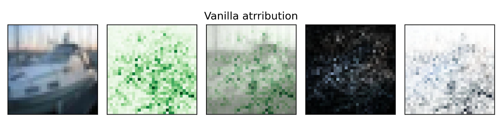
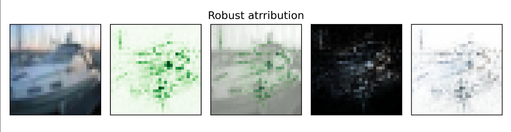

# Adversarial Saliency-guided Training





## Installation

```
pip install git+https://github.com/Uzukidd/ASGT-module
```

## Usage

See `test/test_resnet_asgt.ipynb` `test/test_alexnet_asgt.ipynb` and `test/explain_resnet.ipynb` for more details.

## References

[Exploring the Interplay of Interpretability and Robustness in Deep Neural Networks: A Saliency-guided Approach](https://arxiv.org/pdf/2405.06278)
